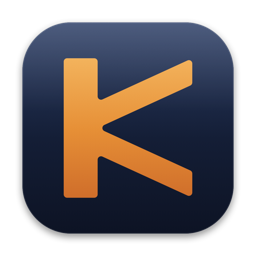
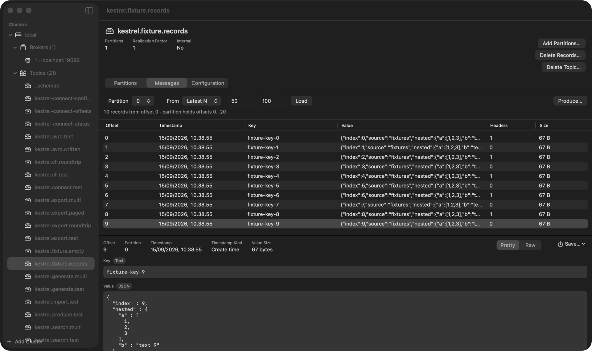
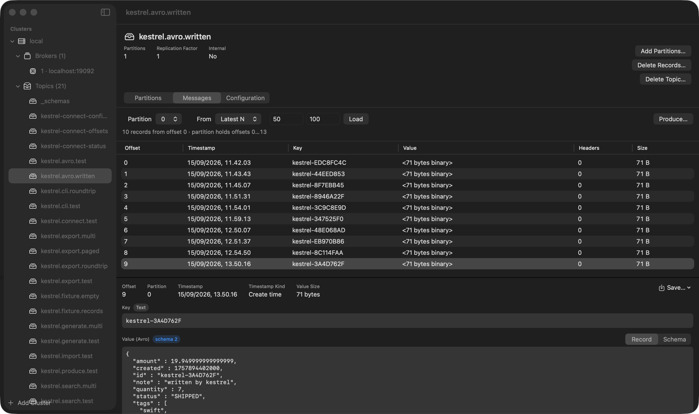
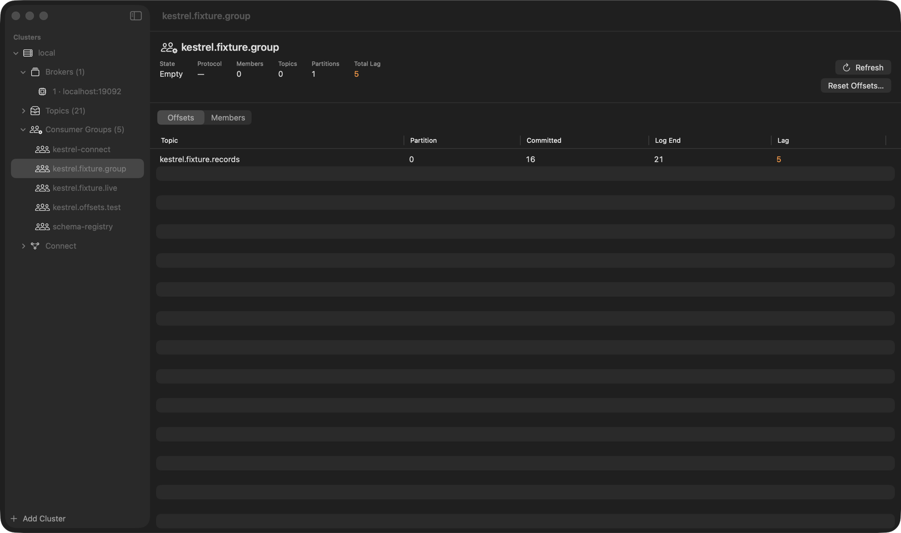
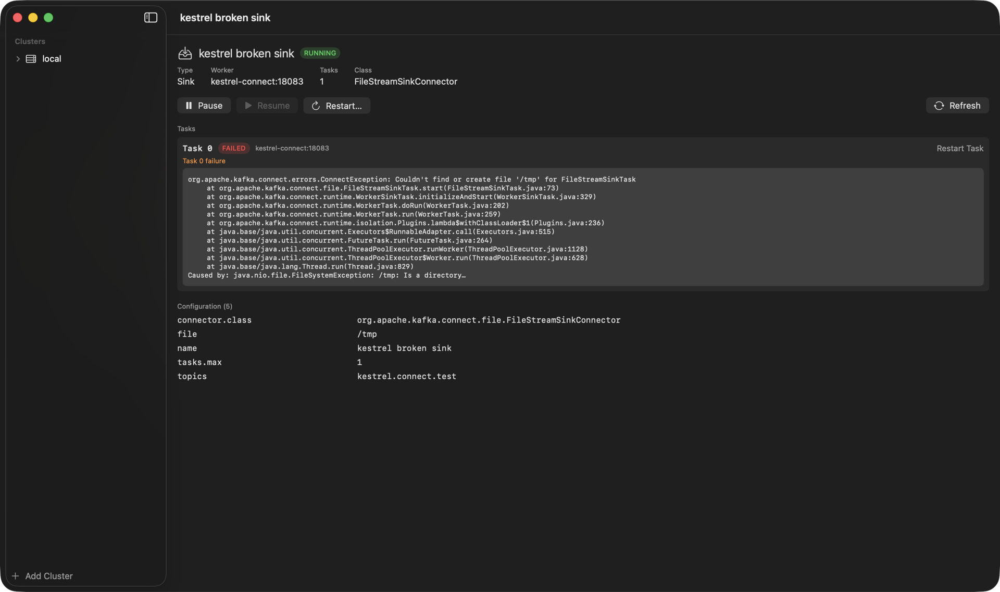
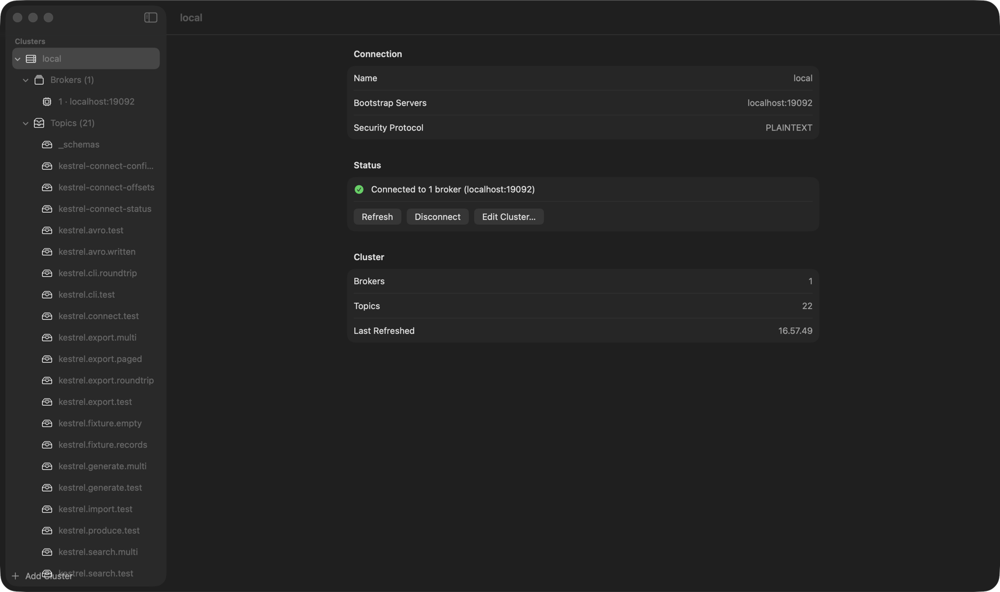

<p align="center">
  
</p>

# Kestrel

A native macOS Apache Kafka explorer — browse clusters, topics, partitions, consumer groups and
records from a real Mac window instead of a browser tab or a wall of `kafka-*.sh` output. Written in
Swift 6 and SwiftUI, shipped as a DMG, with a `kestrel` command line tool that shares the same
engine as the window.

Requirements: **macOS 14 or newer, Apple silicon**.



## What it does

- **Clusters** — save as many as you like: plaintext, SSL, SASL (PLAIN, SCRAM, GSSAPI). Passwords
  and TLS key passphrases go to the login keychain, never to disk in the clear.
- **Topics** — partitions, leaders, replicas and ISR; create, delete, and read the effective
  broker-side configuration.
- **Records** — consume from the earliest offset, the latest *N*, or a numeric offset, with a
  detail pane that pretty-prints JSON and decodes **Avro** through a Schema Registry.
- **Producing** — send a record by hand, from a file, or from key and value templates that generate
  as many as you ask for, compressed with **gzip, Snappy, LZ4 or Zstandard** if the topic expects it.
- **Consumer groups** — members, committed offsets, lag, and offset resets.
- **Schema Registry** — browse subjects and versions, fetch a schema, and use it to encode or decode.
- **Kafka Connect** — list connectors with task status, and pause, resume or restart them; a failed
  task shows its real stack trace.
- **Search** — find text across keys and values in one topic or a whole cluster.
- **Export / import** — write records to JSONL or to another topic, and replay them back.

Everything above is also available from the [`kestrel` CLI](#the-kestrel-command-line).

## Screens

Avro values are decoded through the Schema Registry and shown as JSON, with the subject and version
that decoded them, and the schema itself one click away:



Consumer groups show committed offsets against the log end, and the lag between them:



Kafka Connect connectors show task state, and a failed task shows the stack trace the worker
reported rather than just the word *failed*:



## Install

### From the DMG (no build tools needed)

Download `Kestrel.dmg` from the [latest release](../../releases/latest), open it, and drag
`Kestrel.app` onto the `Applications` folder in the window.

Kestrel is signed **ad-hoc**, not with an Apple Developer ID, so the first open needs a detour:
right-click (or Control-click) `Kestrel.app` and choose **Open**, then confirm. A plain double-click
offers only *Move to Bin*. macOS remembers the decision, so this is needed once. If the Open option
does not appear:

```
xattr -dr com.apple.quarantine /Applications/Kestrel.app
```

Nothing else is required: the Kafka client library and its dependencies are inside the bundle.

### From source

Prerequisites: Swift 6.2 or newer (Xcode or the Command Line Tools, `xcode-select --install`), and
librdkafka:

```
brew install librdkafka
```

SwiftPM finds it through `pkg-config`, so no paths are hardcoded. Then:

```
git clone https://github.com/enrinal/kestrel.git
cd kestrel
swift build                  # compile
Scripts/build-app.sh debug   # stage build/Kestrel.app, prints its path
open build/Kestrel.app
```

`Scripts/build-app.sh release` produces the bundle the DMG wraps, and `Scripts/make-dmg.sh` builds
`dist/Kestrel.dmg` from it.

The app bundle is staged by a script rather than by `xcodebuild`, so the project builds with the
Command Line Tools alone. The script also makes the bundle **self-contained**: every Homebrew dylib
the binaries reach — librdkafka plus lz4, zstd, libssl and libcrypto — is copied into
`Contents/Frameworks` and the references rewritten to `@rpath`. Without that the app would only run
on a Mac that has already run `brew install librdkafka`, which is not a thing to ask of someone who
has just opened a disk image.

## First run

1. Start a Kafka to point at. If you do not already have one, Kestrel ships its own — see
   [a Kafka to develop against](#a-kafka-to-develop-against).
2. Open Kestrel and add a cluster: a name and `bootstrap servers` (for the bundled broker,
   `localhost:19092`) are enough for a plaintext cluster. TLS and SASL fields are on the same sheet.
3. Select the cluster in the sidebar to connect. Brokers, topics and groups fill in underneath it.



## The `kestrel` command line

The same KestrelKit library the window uses, driven from a terminal, so the two cannot disagree
about what a cluster holds.

The CLI ships inside the app bundle, at `Contents/Helpers/kestrel` — in `Helpers` rather than
`MacOS` because `kestrel` and `Kestrel` cannot share a directory on a case-insensitive volume. To
put it on your PATH:

```
sudo ln -sf /Applications/Kestrel.app/Contents/Helpers/kestrel /usr/local/bin/kestrel
```

From a source checkout it is `.build/debug/kestrel` after `swift build`:

```
swift build
.build/debug/kestrel topics --cluster local
```

`--cluster` names a profile saved by the app, so the CLI shares its bootstrap servers, TLS, SASL,
registry and Connect settings. `--bootstrap host:port` works with nothing saved, for a plaintext
cluster.

| Command | Does |
| --- | --- |
| `clusters` | lists the saved profiles, without needing a broker |
| `brokers` | lists the cluster's brokers |
| `topics [<topic>]` | lists topics, or one topic's partitions, leaders and ISR |
| `topics create\|delete <topic>` | adds or removes a topic; `create` is idempotent |
| `consume <topic>` | reads a page of records, decoding Avro as the detail pane does |
| `produce <topic>` | sends one record, optionally Avro-encoded against a subject |
| `groups [<group>]` | lists groups, or one group's committed offsets and lag |
| `schema [<subject>]` | lists registry subjects, or fetches a schema |
| `connect [<action>]` | lists connectors, or status/config/pause/resume/restart |
| `import <file>` | produces the records in a file |
| `export <topic>` | writes records to a JSONL file or another topic |
| `generate <topic>` | produces records from key and value templates |
| `find <text>` | searches keys and values across topics |

`--compression <codec>` on any of the producing commands overrides the profile's codec for that run;
see [Compression](#compression).

`--json` switches every command to machine-readable output. Values are JSON **strings** even when
they look like numbers, so a topic named `42` stays `"42"`; pipe through `tonumber` if a number is
wanted. `consume --json` prints one saved envelope per line, which is exactly what `import` reads,
so a consume can be piped back into a produce.

Exit codes are `0` success, `1` the command failed, `2` the command line was wrong, so a script can
tell a typo from a broker refusing without parsing messages.

### The Keychain prompt

Secrets belong to the binary that wrote them. The app wrote them, `kestrel` is a different binary,
so the first read of a password makes macOS ask you to allow it. In a script or over ssh that prompt
cannot be answered and the command looks like it has hung. Two things keep that out of the way:

- Only the secrets a profile's settings actually call for are read, so a plaintext cluster with no
  registry and no Connect never prompts.
- `--no-keychain` skips the saved secrets entirely. Use it in scripts.

Clicking **Always Allow** on the prompt once is the other way; it adds `kestrel` to that item's
access list.

## Compression

Reading a compressed topic needs no setting at all: a batch carries the codec it was written with,
and the client decompresses it before Kestrel sees a record. gzip, Snappy, LZ4 and Zstandard all
read out of the box.

Writing is the one that has to be told. **Edit Cluster ▸ Producing ▸ Compression** sets the codec
for everything the app sends to that cluster, and defaults to *None*, which is what Kafka clients
do unless asked otherwise. The CLI takes `--compression` on any command that produces — `produce`,
`import`, `generate`, and `export --to-topic` — overriding the profile for that run only:

```
kestrel produce orders --cluster staging --value '{"id":1}' --compression snappy
```

`kestrel clusters` lists each profile's codec, since it changes what a produce puts on the wire
without otherwise showing up anywhere.

## Where settings live

- Cluster list: `~/Library/Application Support/Kestrel/clusters.json` — never contains secrets
- Passwords and TLS key passphrases: login keychain, service `dev.kestrel.Kestrel`,
  account `<cluster uuid>.<secret>`

## Development

### A Kafka to develop against

Kestrel brings its own single-node broker, on port **19092** rather than the usual 9092 so it can
run alongside any other Kafka on the machine:

```
docker compose -f Docker/kafka.yml up -d     # start
docker compose -f Docker/kafka.yml down -v   # stop and discard the data
```

The compose file also brings up a **Schema Registry on port 18081** and a **Kafka Connect worker on
port 18083**, which the Avro and Connect features need. The broker advertises two listeners for it:
`localhost:19092` for clients on the Mac, and `kestrel-kafka:29092` for other containers, since
"localhost" inside the registry's container is the registry itself.

Auto-creation of topics is off on this broker, so a producer cannot conjure a topic from a typo.

Note that `cp-kafka-connect` is a large image; the first `up` spends several minutes pulling it.

### Checks

The Command Line Tools ship neither XCTest nor swift-testing, so `swift test` cannot build without a
full Xcode. Checks are a plain executable that exits non-zero on failure:

```
swift run KestrelChecks
```

They create the topics and consumer groups they need on first run (`kestrel.fixture.*`), so the
suite does not depend on data from any other stack. The Avro fixture is written by Confluent's own
`kafka-avro-console-producer`, so the decoder is checked against records this build did not encode.
The Connect checks deploy two FileStream connectors, one of them deliberately broken, so a failed
task with a real stack trace is covered too.

Add `KESTREL_SEED_DEFAULT_STORE=1` to also write a `local` profile to the real
`~/Library/Application Support/Kestrel/clusters.json` and its password to the login keychain, which
is how the app's restore-on-launch behaviour is verified.

### Headless UI check

macOS denies a terminal both cross-process window titles and `screencapture` unless it has been
granted permission, so the app can inspect itself instead. Set `KESTREL_SNAPSHOT` to a PNG path;
Kestrel captures its key window, prints the window title and size, then exits. `KESTREL_SNAPSHOT_DELAY`
(seconds, default 2) controls how long it waits for layout, and `KESTREL_SNAPSHOT_DEBUG=1` lists
every window it can see.

```
KESTREL_SNAPSHOT=/tmp/kestrel.png ./build/Kestrel.app/Contents/MacOS/Kestrel
```

The screenshots in this README were captured this way, so they are the real window rather than a
mockup. Capture is attempted three ways, in order, keeping the first result that actually contains pixels:

| Mode | Needs permission | Fidelity |
| --- | --- | --- |
| `windowServer` | Screen Recording | exact |
| `pdf` | none | chrome and table headers, but SwiftUI text is missing |
| `cacheDisplay` | none | geometry only |

**Grant Screen Recording to the terminal (System Settings ▸ Privacy & Security) for usable
screenshots.** Without it the window server silently returns a fully transparent image, which the
hook detects and discards before falling through to the lossy paths.

Because the window cannot be driven from outside the process either, `KESTREL_SNAPSHOT_ACTIONS`
takes a comma-separated list of steps to run before the capture: `select-first`, `connect`,
`expand-all`, `expand-groups`, `load-groups`, `select-broker`, `select-topic`, `load-configs`,
`dump-selection`, and `dump-topics`. `dump-selection` prints the selected inspector's contents, so
UI state can be checked in text when a screenshot cannot be trusted; `dump-topics` prints the
sidebar's topic list, which is how the CLI's output is diffed against the window's.

```
KESTREL_SNAPSHOT=/tmp/kestrel.png \
  KESTREL_SNAPSHOT_ACTIONS=select-first,connect,select-topic,load-configs,dump-selection \
  ./build/Kestrel.app/Contents/MacOS/Kestrel
```

### The icon

The icon is generated, not checked in as an opaque binary, so it can be changed by editing numbers:

```
swift Scripts/make-icon.swift    # writes Resources/AppIcon.icns
```

It is a K with two swept blades on a slate-blue plate. It is deliberately **not** a bird: a kestrel
seen from below came out as a stingray, a rounded head in profile as a kiwi, and an angular head as
a pentagon with a nub. A silhouette a few pixels across keeps only its outline, and a rounded
outline becomes whichever animal the viewer thinks of first. A letterform cannot be mistaken for the
wrong animal, and a check asserts the 16px rendition still has visible amber on it.

### Layout

| Path | Holds |
| --- | --- |
| `Sources/KestrelKit` | models, persistence, Keychain, and the Kafka, Registry and Connect clients |
| `Sources/KestrelApp` | the SwiftUI window (target is `KestrelApp`, not `Kestrel` — see below) |
| `Sources/KestrelCLI` | the `kestrel` command line tool |
| `Sources/KestrelChecks` | the check suite |
| `Sources/Crdkafka` | the librdkafka system library shim |
| `Scripts` | bundle staging, DMG, icon generation |
| `Docker` | the development broker, Schema Registry and Connect worker |

The app's SwiftPM target is **`KestrelApp`**, not `Kestrel`, because the CLI product is `kestrel`
and an APFS volume is case-insensitive by default: two products whose names differ only in case
write to the same file in `.build` — whichever linked last wins, and `kestrel` would silently launch
the GUI and hang. The file inside the bundle is still named `Kestrel`, which is what
`CFBundleExecutable` says.

## Stack

- Swift 6.2 + SwiftUI
- librdkafka for the Kafka protocol
- Keychain for cluster secrets
- `hdiutil` for the DMG

## Licence

MIT — see [LICENSE](LICENSE).

Kestrel is an independent, clean-room implementation. It carries no Offset Explorer branding, icons
or UI, and is not affiliated with or endorsed by its authors, or by the Apache Software Foundation.
Apache Kafka is a trademark of the Apache Software Foundation.
